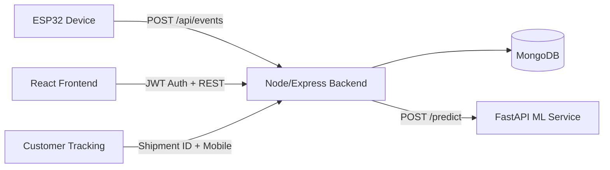

# IntelliShip

Production-ready IoT logistics monitoring platform with MERN + ESP32 + ML inference.

## Architecture



## Core Status Model

### Lifecycle Status

- `CREATED`
- `PACKED`
- `IN_TRANSIT`
- `OUT_FOR_DELIVERY`
- `DELIVERED`
- `DAMAGED` (optional transition from transit states)

### Condition

- `SAFE`
- `RISK`
- `DAMAGED`

## Tracking ID Format

Tracking IDs are generated as:

- `SHIP` + last 8 digits of epoch timestamp + 5 uppercase base36 chars
- Example: `SHIP12345678ABC12`

## API Overview

### Auth

- `POST /api/auth/signup`
- `POST /api/auth/signin`
- `GET /api/auth/verify`
- `POST /api/auth/logout`

### Shipments

- `POST /api/shipments` (seller/admin)
- `PATCH /api/shipments/:id/status` (seller/admin)
- `POST /api/shipments/:id/start-monitoring` (seller/admin)
- `GET /api/shipments` (seller/admin)
- `POST /api/shipments/track` (public secure: shipment ID + mobile)
- `GET /api/shipments/:id` (public QR fallback)

### Events

- `POST /api/events` (ESP32 ingestion)
- `GET /api/events/:shipment_id`

### Analytics

- `GET /api/analytics`

## Setup

### 1. Backend

```bash
cd smart-logistics-backend
npm install
cp .env.example .env
npm run dev
```

### 2. Frontend

```bash
cd frontend
npm install
npm run dev
```

Use `.env` in frontend with:

```env
VITE_API_BASE_URL=http://localhost:5000
```

### 3. ML Service

```bash
python train_model.py
cd ml-service
pip install -r requirements.txt
uvicorn app:app --reload --port 8000
```

### 4. ESP32

- Flash `arduino_code.ino`
- Configure WiFi credentials and `shipmentID`
- Device sends `intensity` + `severity` + vibration features to backend

## Testing

### Backend

```bash
cd smart-logistics-backend
npm test
```

### Frontend

```bash
cd frontend
npm run test:run
```
